# OBSIDIAN


<p>
  <a href="README.md"></a>
  <a href="README.en.md"></a>
  
</p>

E-commerce full-stack d'una botiga de roba urbana creat com a projecte de portfolio: una botiga React amb estètica fosca i accents daurats, connectada a una API Laravel 11, desplegada amb base de dades de producció i fluxos reals d'usuari autenticat.

L'objectiu és demostrar com es planifica, s'implementa i es desplega una aplicació de comerç amb un enfocament real: catàleg servit per l'API, àrea de compte autenticada, cistella i wishlist sincronitzades, creació de comandes, desplegament a producció i decisions tècniques documentades.

## Captures

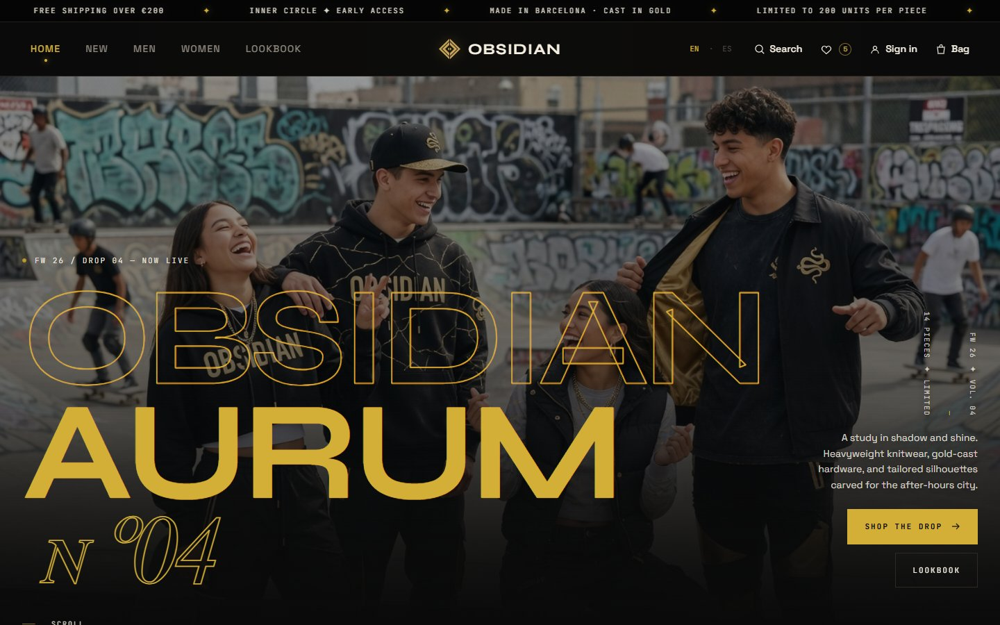

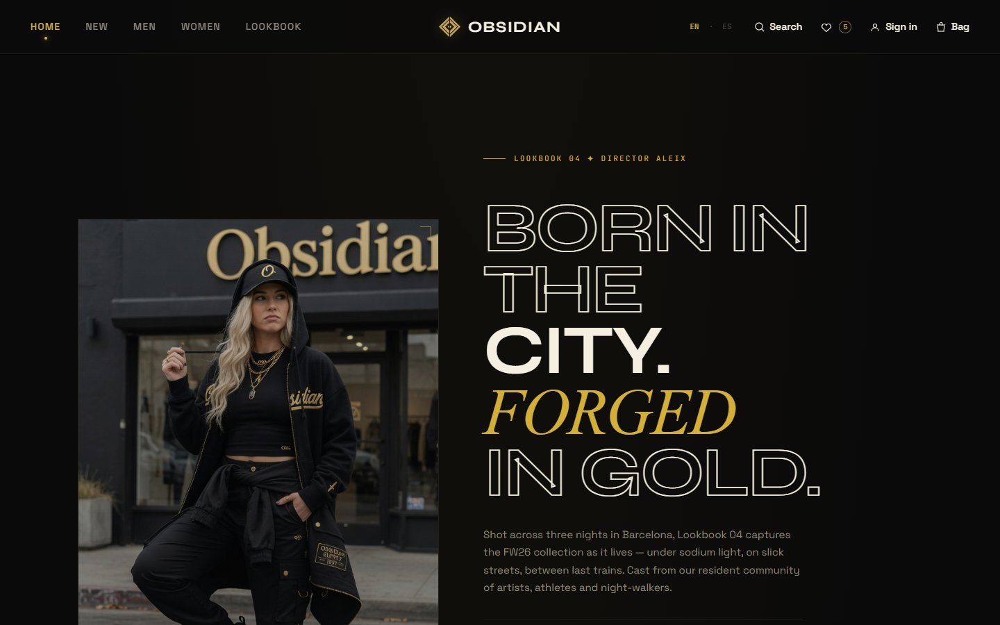

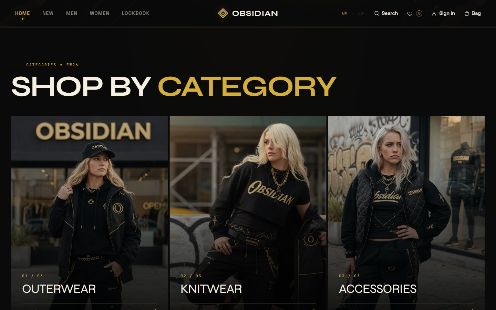

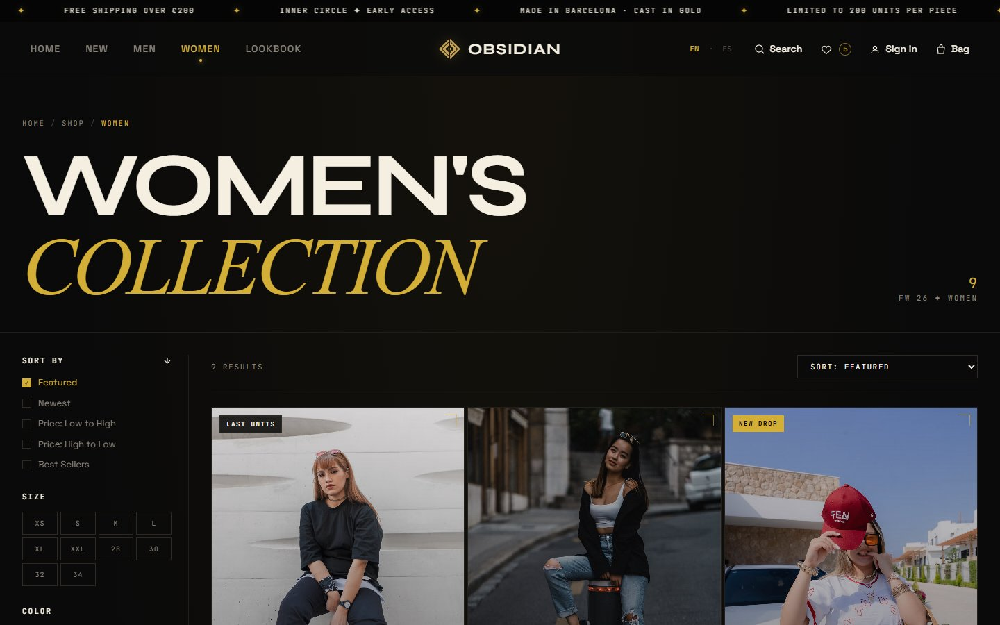

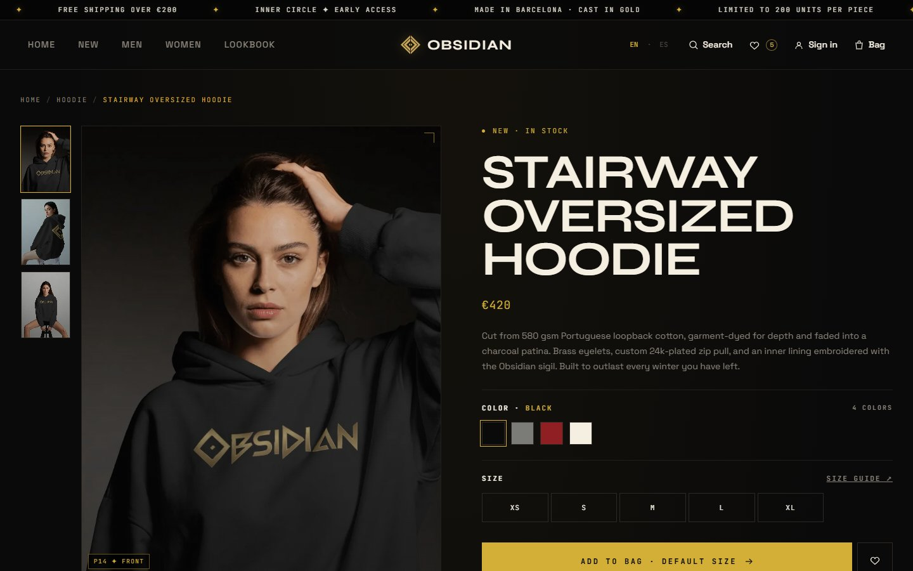

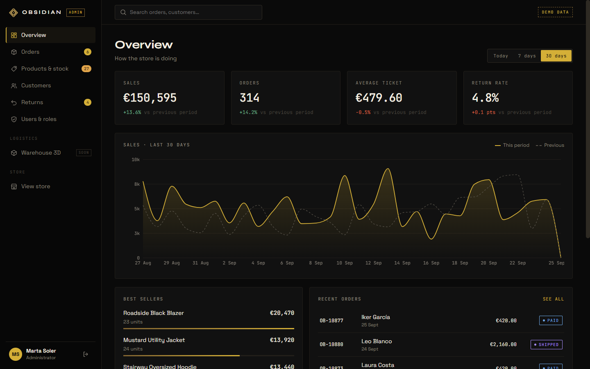

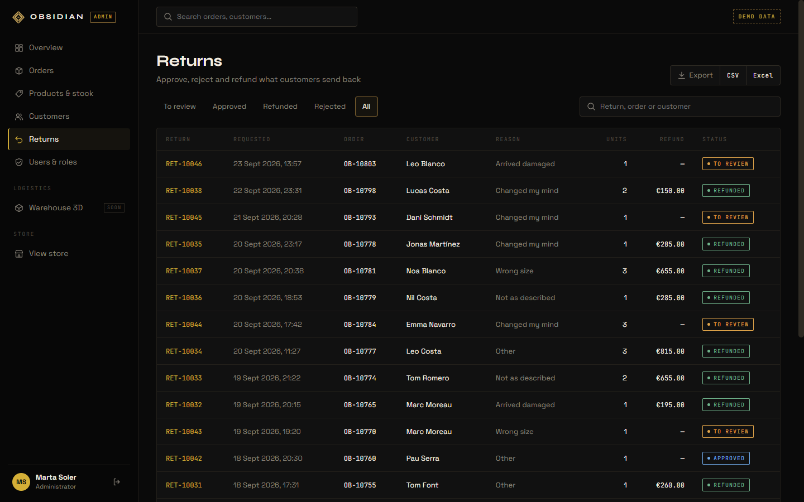

## Abast del projecte

Aquest repositori conté el frontend. El backend és a
[`AleixAj/obsidian-api`](https://github.com/AleixAj/obsidian-api).

Funcionalitats implementades:

- CI de portfolio amb lint, typecheck, tests unitaris i build a GitHub Actions.
- Desplegament de producció: [`obsidian.aleixaj.com`](https://obsidian.aleixaj.com).
- Catàleg servit per endpoints de Laravel (`/api/products`, `/api/categories`).
- Pàgines de llistat amb filtres per categoria, talla, color i preu, i ordenació.
- Pàgina de producte amb galeria, selector de talla/color i secció "complete the look".
- Calaix (drawer) de la cistella amb quantitats, totals, progrés cap a l'enviament gratuït, sincronització amb el backend i checkout bàsic.
- Wishlist persistent per als convidats i sincronitzada amb el backend per als usuaris autenticats.
- Tauler (dashboard) del compte amb resum, comandes, CRUD d'adreces i ajustos del perfil.
- Registre/inici de sessió amb correu electrònic i contrasenya mitjançant sessions de cookie de Laravel Sanctum.
- Fusió de la cistella/wishlist de convidat després d'iniciar sessió o registrar-se.
- Checkout bàsic que converteix la cistella autenticada en una comanda real.
- Disseny responsive fins a mòbil.
- Skeletons de càrrega i estats d'error amb opció de reintentar.
- React Query Devtools en desenvolupament.
- Panell d'administració a `/admin` amb rols, comandes, estoc, clients, devolucions, equip i magatzem en 3D ([vegeu la secció](#panell-dadministració-admin)).
- Accés de demostració amb un clic (botiga i panell) per revisar el projecte sense registrar-se.
- Test d'extrem a extrem amb Playwright del flux principal.
- Botiga i panell en castellà i anglès, també les dades de la demostració ([vegeu la secció](#idiomes-es--en)).

## Panell d'administració (`/admin`)

Una eina interna com la d'una botiga real, dins la mateixa SPA però carregada a part
(els visitants de la botiga no en descarreguen el codi).

**Proveu-lo sense registrar-vos:** entreu a [`/admin/login`](https://obsidian.aleixaj.com/admin/login)
i trieu un rol amb els botons de demostració: Aleix Auqué (administració), Javier Molina
(magatzem) o Lucía Fernández (atenció al client). A l'inici de sessió de la botiga també hi
ha un accés de "client de demostració". Les dades d'exemple (unes 900 comandes de 90 dies,
60 clients, estoc i devolucions) es reinicien soles cada 24 hores i són coherents: cada
comentari de devolució encaixa amb el seu motiu i cada adreça és de la seva ciutat.

Els comptes de l'equip (també els de demostració) veuen un botó **Admin** / **Administración** a la
capçalera de la botiga per entrar-hi directament; els clients no el veuen.

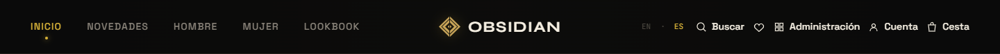

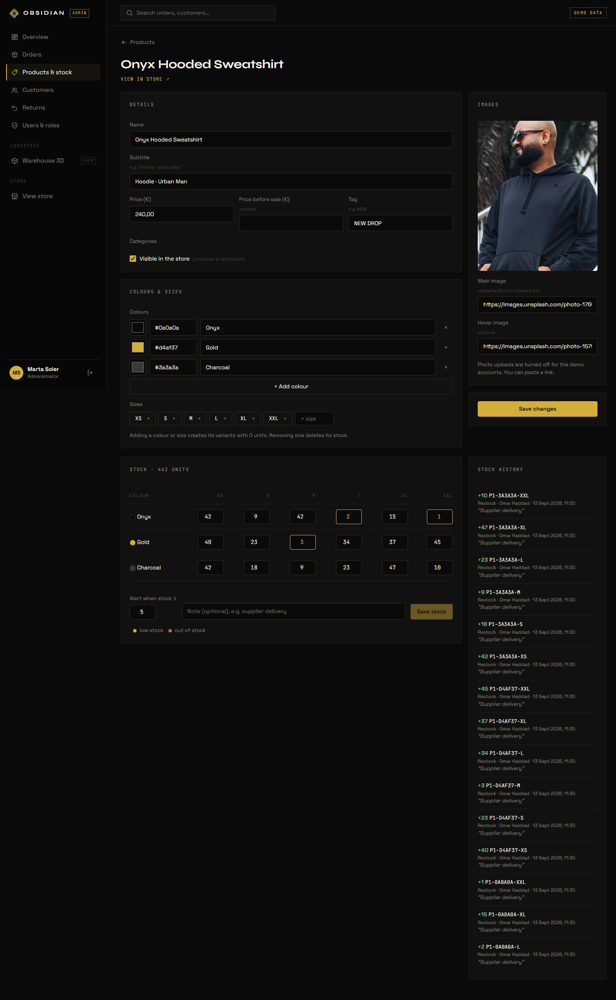

| Secció | Què fa |
|---|---|
| Resum | Vendes, comandes, tiquet mitjà i taxa de devolucions (avui / 7 / 30 dies) comparats amb el període anterior, gràfica, més venuts, darreres comandes i avisos d'estoc baix. |
| Comandes | Filtres, cerca, detall i canvi d'estat pas a pas (pagada → en preparació → enviada → lliurada) amb historial de qui ho ha fet. |
| Productes i estoc | Crear i editar productes, colors, talles i fotos (pujades des de l'ordinador). Estoc per color i talla amb historial de moviments. La compra descompta estoc. |
| Clients | Llistat amb el total gastat i fitxa amb adreces i historial de comandes. |
| Devolucions | El client la demana des del seu compte (30 dies); atenció al client l'aprova o la rebutja i fa el reemborsament (simulat, encara sense Stripe). L'estoc torna sol. |
| Usuaris i rols | Equip, taula de permisos, afegir persones i canviar-ne el rol. |
| Magatzem 3D | 192 ubicacions (passadís, mòdul i nivell) dibuixades en 3D: cada caixa té el color del seu estoc i l'alçada de com de plena està. Vistes Pla i Llista per al mòbil, cerca per SKU o ubicació, reposar i moure productes. |
| Exportar | Cada llistat es descarrega en CSV o Excel. |

**Magatzem en 3D** (`/admin/warehouse`): fet amb react-three-fiber (Three.js escrit com a
components de React). Fa servir les mateixes dades que la resta del panell: cada ubicació
guarda una variant i el seu estoc, i reposar crea un moviment d'estoc normal. El codi 3D només
es descarrega en obrir aquesta pàgina, i al mòbil o sense WebGL s'obre la vista Pla.

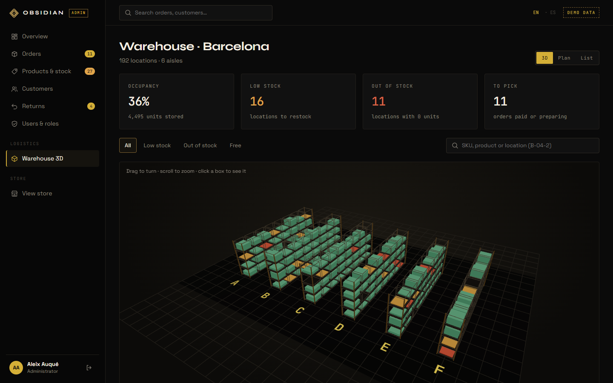

**Rols** (l'API els comprova a cada petició, no només a la interfície):

| | Administració | Magatzem | Atenció al client |
|---|:---:|:---:|:---:|
| Resum i comandes | ✓ | ✓ | ✓ |
| Estoc | ✓ | ✓ | |
| Editar productes | ✓ | | |
| Clients i devolucions | ✓ | | ✓ |
| Usuaris i rols | ✓ | | |

**Decisions:**

- Permisos en un sol lloc (`App\Enums\Role` a l'API) i Gates de Laravel a les rutes.
- Els comptes de demostració són compartits: només veuen dades de demostració i no poden
  pujar fitxers, canviar el catàleg públic ni l'equip (si no, qualsevol es podria donar
  accés d'administrador). Les dades de demostració es restauren cada dia.
- Les fotos es redueixen i es desen en WebP amb GD, en un volum de Railway.
- Gràfiques amb Recharts; Excel amb OpenSpout.

**Tests:** 125 tests de l'API (permisos per rol, comptes de demostració, estoc, devolucions, checkout i seguretat) i un test d'extrem a extrem amb
Playwright (`e2e/main-flow.e2e.ts`): un client demana una devolució, atenció al client
l'aprova i la reemborsa, el client veu el reemborsament, magatzem prepara una comanda, reposa una ubicació i
no pot veure clients, i administració revisa el resum i l'equip. S'executa a la CI de
l'API a cada push i cada nit.

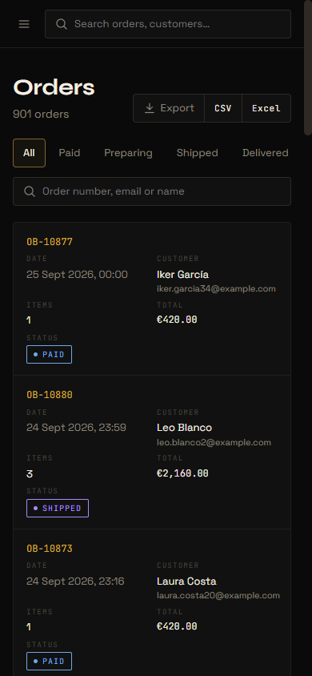

## Idiomes (ES / EN)

Tot el web (botiga, compte, pàgines legals i panell) està en castellà i anglès.

- **Idioma per defecte:** el que es va triar l'última vegada (es desa al navegador) o, si no,
  el del navegador: castellà si està en castellà, anglès en la resta de casos. Es canvia amb
  les banderes de la capçalera i del panell.
- **Textos del web:** amb i18next. Són a `src/i18n/locales/{en,es}/`, separats per zones
  (`common`, `shop`, `account`, `legal`, `admin`). Un test (`locales.test.ts`) comprova que
  els dos idiomes tenen les mateixes claus.
- **Preus, dates i percentatges** fan servir el format de cada idioma ("1.485,00 €" / "€1,485.00").
- **Paraules del catàleg** que l'API desa en anglès (etiquetes com "NEW", tipus de peça,
  colors, la talla "ONE"…) es tradueixen a `src/i18n/catalog.ts`. Els noms dels productes es
  queden en anglès, com a noms de marca. El cercador entén les dues versions ("hoodie" i "sudadera").
- **API:** el web envia `Accept-Language` a cada petició i Laravel respon en aquest idioma
  (errors de validació, missatges, estats, rols i capçaleres de les exportacions).
- **Dades de la demostració:** es desen un sol cop, en anglès, i l'API les tradueix en
  enviar-les (notes d'estoc, comentaris de devolucions, historial de comandes…). El que escriu
  una persona de debò es mostra tal com és.

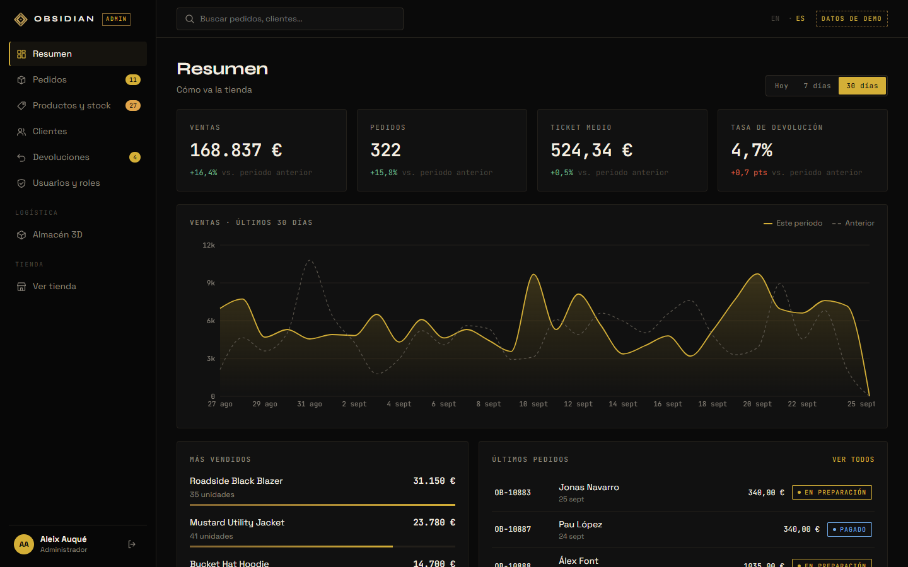

## Seguretat i protecció

El web està pensat per estar obert al públic (amb comptes de demostració compartits), així
que es protegeix contra abusos i errors tant a l'API com a la interfície:

- **Límits de peticions** per visitant real: inici de sessió (per email i IP), registre,
  accés de demostració, checkout, devolucions, pujades de fotos i exportacions tenen el seu
  propi límit, i la resta de l'API un de general.
- **Només a través de Cloudflare:** el Worker afegeix una clau secreta i la IP real del
  visitant. Laravel rebutja les peticions que arriben directes a Railway sense aquesta clau.
- **Capçaleres de seguretat** al web i a l'API (HSTS, `nosniff`, `X-Frame-Options`,
  `Referrer-Policy`, `Permissions-Policy`) i una Content-Security-Policy en mode informe.
- **Comptes de demostració aïllats:** només veuen i modifiquen dades de demostració (clients
  i comandes inventats) i no poden canviar el catàleg públic, pujar fitxers ni tocar l'equip.
- **Comptes:** si algú entra amb Google en un compte creat abans amb contrasenya, aquesta
  contrasenya s'anul·la (evita que un altre registri el teu email abans que tu). A l'equip
  només s'hi afegeixen comptes que ja han entrat amb Google/GitHub, i el compte del
  propietari és administrador mitjançant la variable `OWNER_EMAIL`, només en entrar amb Google.
- **Comandes i estoc:** el preu sempre el calcula el servidor, no es pot vendre ni retornar
  més del que hi ha, cancel·lar una comanda retorna l'estoc, les operacions importants
  bloquegen el registre perquè un doble clic no les repeteixi, i el panell avisa si l'estoc
  ha canviat mentre l'editaves.
- **Exportacions** a CSV/Excel sense fórmules perilloses als textos dels clients.
- **Errors:** si una part de la pàgina falla es mostra un avís en lloc d'una pantalla en
  blanc, i després d'un desplegament el web es recarrega sol per agafar la versió nova.

## Stack tècnic

| Capa | Elecció | Motiu |
|---|---|---|
| Build | Vite 8 | Desenvolupament SPA ràpid i desplegament estàtic senzill. |
| UI | React 19 | Model de components, hooks i bona rellevància professional. |
| Llenguatge | TypeScript 6 | Refactoritzacions més segures i models de domini compartits. |
| Routing | React Router 7 | Pàgines i seccions del compte guiades per URL. |
| Estat del servidor | TanStack React Query 5 | Memòria cau, estats de càrrega/error, reintents i deduplicació de peticions. |
| Estat del client | React Context | Cistella, wishlist i toasts sense afegir Redux. |
| Persistència | `localStorage` + cistella/wishlist al backend | Els convidats conserven les dades; els usuaris se sincronitzen amb Laravel en autenticar-se. |
| Estils | CSS pla + tokens | Demostra els fonaments de CSS sense dependre d'un framework. |
| Backend | API Laravel 11 | Repositori separat, endpoints REST, autenticació Sanctum i MySQL a producció. |
| 3D | react-three-fiber + drei | Three.js com a components de React, per al magatzem del panell. |
| Idiomes | i18next + react-i18next | Botiga i panell en castellà i anglès. Es tria segons el navegador i es pot canviar amb les banderes. L'API respon en el mateix idioma. |
| Desplegament | Cloudflare Workers + Assets + Railway | SPA a l'edge de Cloudflare, API Laravel amb MySQL gestionat. |

## Arquitectura

El frontend manté clara la frontera amb l'API:

```txt
DTOs de l'API Laravel
      |
src/lib/api.ts
  - fetchProducts()
  - fetchProduct()
  - fetchCategories()
  - toProduct()
  - toCategoryMap()
      |
src/hooks/queries/
  - useProducts()
  - useProduct()
  - useCategories()
  - useAuth()
  - useAccount()
  - useCartSync()
  - useWishlistSync()
      |
Pàgines i components reben objectes Product llestos per a la UI
```

Això evita que la UI renderitzi directament camps del backend com `price_cents` o `img_alt`. Si canvia la forma de l'API, l'adaptador s'actualitza en un únic punt.

### Configuració de QueryClient

`src/lib/queryClient.ts` defineix un client compartit:

- `staleTime: 60_000`, perquè el catàleg canvia poc durant una sessió.
- `retry: 1`, per recuperar-se de fallades transitòries sense endarrerir massa l'usuari.
- `refetchOnWindowFocus: false`, per evitar recàrregues sorolloses en canviar de pestanya.

### Estat local i estat del servidor

React Query gestiona les dades del servidor (`products`, `categories`, `user`, `account`, `cart` autenticat, `wishlist` autenticada). React Context gestiona l'estat local de la UI (`toasts`) i exposa les API de cistella/wishlist als components.

Els convidats fan servir `localStorage`, els usuaris autenticats fan servir l'API Laravel, i tots dos estats es fusionen després d'iniciar sessió o registrar-se. Així la navegació com a convidat és ràpida sense perdre la portabilitat entre dispositius.

## Estructura del projecte

```txt
src/
├── admin/             # Panell /admin: pàgines, components, API i hooks propis
├── components/
│   ├── cart/          # CartDrawer
│   ├── layout/        # Header, Footer, AnnounceBar, Layout
│   ├── product/       # ProductCard, ProductCardSkeleton
│   └── ui/            # Logo, Icon, Marquee, Placeholder, Reveal
├── context/           # CartContext, WishlistContext, ToastContext
├── data/              # Recursos visuals/editorials de marca
├── hooks/
│   ├── queries/       # Hooks de React Query
│   ├── useLocalStorage.ts
│   └── useReveal.ts
├── i18n/              # Traduccions ES/EN (i18next) i paraules del catàleg
├── lib/               # Client de l'API + QueryClient
├── pages/             # Home, Shop, Product, Lookbook, Auth, Account, Legal, NotFound
├── styles/            # Tokens CSS, estils globals i estils per pàgina
├── types/             # Product, CartItem, Category
└── utils/             # formatPrice, pad
```

## Configuració local full-stack

### 1. Arrencar el backend

```powershell
cd C:\Users\Kylen\Desktop\Projects\obsidian-api
php artisan serve
```

Laravel hauria d'estar disponible a `http://localhost:8000`.

Comprovacions útils:

```powershell
Invoke-RestMethod http://localhost:8000/api/health
Invoke-RestMethod http://localhost:8000/api/products
Invoke-RestMethod http://localhost:8000/api/categories
```

### 2. Arrencar el frontend

```powershell
cd C:\Users\Kylen\Desktop\Projects\obsidian
npm install
npm run dev
```

Vite hauria d'estar disponible a `http://localhost:5173`.

El frontend llegeix la URL base de l'API de:

```env
VITE_API_URL=http://localhost:8000
```

A producció fa servir:

```env
VITE_API_URL=https://obsidian-api-production-8b5e.up.railway.app
```

## Scripts

```bash
npm run dev        # arrenca Vite en mode desenvolupament
npm run typecheck  # comprova TypeScript sense emetre fitxers
npm run test:ci    # executa els tests unitaris amb Vitest
npm run build      # build de producció
npm run preview    # previsualitza dist en local
npm run lint       # ESLint
npm run e2e        # test d'extrem a extrem (arrenca l'API i la botiga)
```

Verificat:

- `npm run typecheck` passa.
- `npm run test:ci` passa.
- `npm run build` passa.
- GitHub Actions executa lint, typecheck, tests i build a cada push/PR.
- Smoke checks de producció contra Railway/Cloudflare.
- L'autenticació Sanctum funciona des de `obsidian.aleixaj.com`.
- Les imatges i les dades del catàleg es carreguen des de l'API de Railway.

## Producció

- Frontend: [`https://obsidian.aleixaj.com`](https://obsidian.aleixaj.com)
- API del backend: [`https://obsidian-api-production-8b5e.up.railway.app`](https://obsidian-api-production-8b5e.up.railway.app)
- Health check: [`/api/health`](https://obsidian-api-production-8b5e.up.railway.app/api/health)
- Demostració sense contrasenya: botó "¿Estás revisando este proyecto?" ("Reviewing this project?" en anglès) a `/auth` i botons de rol a `/admin/login`

Notes de desplegament:

- El frontend es desplega amb Cloudflare Workers + Assets mitjançant `wrangler.jsonc`.
- Ordre de build a Cloudflare: `npm run build`.
- Ordre de desplegament: `npx wrangler deploy`.
- El fallback de la SPA es gestiona amb `not_found_handling="single-page-application"`.
- Es va eliminar l'antic `_redirects` perquè provocava un bucle de redireccions a Workers + Assets.
- `src/lib/api.ts` evita que els builds de producció facin servir `localhost:8000` per error.

## Contracte amb el backend

Actualment el frontend consumeix:

| Mètode | Endpoint | Ús |
|---|---|---|
| `GET` | `/api/products` | Home, recomanacions, Account |
| `GET` | `/api/products?category={slug}` | Pàgines Shop per categoria |
| `GET` | `/api/products/{slug}` | Detall del producte |
| `GET` | `/api/categories` | Metadades de la capçalera de Shop |
| `GET` | `/api/health` | Smoke checks / monitoratge manual |
| `GET` | `/api/user` | Usuari autenticat actual |
| `PATCH` | `/api/user` | Actualitzar nom/correu electrònic |
| `POST` | `/api/auth/register` | Crear un compte i iniciar sessió |
| `POST` | `/api/auth/login` | Inici de sessió amb correu i contrasenya |
| `POST` | `/api/auth/logout` | Tancament de sessió al servidor |
| `GET` | `/api/account` | Resum del tauler del compte |
| `GET` | `/api/orders` | Comandes de l'usuari |
| `GET` | `/api/addresses` | Adreces de l'usuari |
| `POST` | `/api/addresses` | Crear una adreça |
| `PATCH` | `/api/addresses/{id}` | Editar una adreça / marcar-la com a predeterminada |
| `DELETE` | `/api/addresses/{id}` | Esborrar una adreça |
| `GET` | `/api/cart` | Cistella autenticada |
| `POST` | `/api/cart/items` | Afegir un producte a la cistella |
| `PATCH` | `/api/cart/items/{id}` | Canviar la quantitat |
| `DELETE` | `/api/cart/items/{id}` | Eliminar una línia |
| `DELETE` | `/api/cart/items` | Buidar la cistella |
| `POST` | `/api/cart/merge` | Fusionar la cistella de convidat després d'iniciar sessió o registrar-se |
| `POST` | `/api/checkout` | Convertir la cistella en una comanda |
| `GET` | `/api/wishlist` | Slugs de la wishlist autenticada |
| `POST` | `/api/wishlist/items` | Afegir un producte a la wishlist |
| `DELETE` | `/api/wishlist/items/{slug}` | Treure un producte de la wishlist |
| `DELETE` | `/api/wishlist/items` | Buidar la wishlist |
| `POST` | `/api/wishlist/merge` | Fusionar la wishlist de convidat després d'iniciar sessió o registrar-se |

Els diners es desen a l'API com a cèntims enters (`price_cents`). L'adaptador els transforma en el `Product.price` que renderitzen els components.

## Configuració d'OAuth

Les rutes d'OAuth amb Google/GitHub estan implementades a Laravel
(`SocialiteController`). Google ja està configurat a producció; les credencials
són variables de Railway:

```env
GOOGLE_CLIENT_ID=
GOOGLE_CLIENT_SECRET=
GOOGLE_REDIRECT_URI=https://obsidian.aleixaj.com/auth/google/callback

GITHUB_CLIENT_ID=
GITHUB_CLIENT_SECRET=
GITHUB_REDIRECT_URI=https://obsidian.aleixaj.com/auth/github/callback
```

**El `redirect_uri` ha d'apuntar al domini públic, no al de Railway.** El
Worker fa de proxy de `/auth/` cap al backend (vegeu `worker.js`), de manera
que la callback arriba igualment a Laravel, però aleshores la cookie de sessió
s'emet sobre `obsidian.aleixaj.com`, que és el domini des del qual la SPA fa
les peticions. Si la callback apunta a `*.up.railway.app`, l'inici de sessió
sembla completar-se i l'usuari torna sense sessió iniciada, perquè la cookie
queda en un altre domini i Sanctum no la rep mai.

Per publicar la pantalla de consentiment de Google en mode producció (sense
llista d'usuaris de prova) calen una URL de política de privadesa i una de
condicions del servei servides des del domini autoritzat: són les rutes `/privacy` i
`/terms` (`src/pages/Legal.tsx`).

Mentre no existeixin aquests valors, els botons socials redirigeixen de nou a
`/auth` amb un error clar de "not configured".

## Configuració de Stripe (pendent)

Les dependències i els placeholders d'entorn de Stripe/Cashier existeixen al backend, però el cobrament real queda ajornat fins que es configurin les claus i el webhook. El checkout actual ja crea comandes reals sense cobrar la targeta.

## Full de ruta

- [x] Etapa 0 - Decisions d'arquitectura.
- [x] Etapa 1 - Backend Laravel 11, esquema, seeders i API pública.
- [x] Etapa 2 - SPA React que consumeix el backend amb React Query.
- [x] Etapa 3 - Autenticació real: correu/contrasenya + rutes OAuth preparades.
- [x] Etapa 4 - Tauler del compte connectat a dades reals.
- [x] Etapa 5 - Cistella de convidat sincronitzada amb l'usuari en iniciar sessió.
- [x] Etapa 6 - Checkout bàsic: cistella autenticada -> comanda.
- [x] Etapa 7 - Wishlist sincronitzada entre dispositius.
- [x] Etapa 8 - Desplegament: Cloudflare Workers + Assets, Railway i usuari de demostració.
- [x] Etapa 9 - Pàgines legals (`/privacy`, `/terms`) requerides per la pantalla de consentiment de Google.
- [x] Etapa 10 - Panell d'administració: rols, comandes, estoc, clients, devolucions, equip i exportació.
- [x] Etapa 11 - Magatzem en 3D: ubicacions per variant, reposició i vistes 3D, pla i llista.
- [x] Etapa 12 - Traducció al castellà i l'anglès del web, el panell, l'API i la demostració.
- [x] Etapa 13 - Revisió de seguretat i errors: límits de peticions, proxy amb clau secreta, comptes de demostració aïllats i integritat de comandes i estoc.
- [ ] Següent - Pagaments reals amb Stripe.

## Per què és important aquest projecte

Obsidian no és només un mockup estàtic. Està estructurat com un petit projecte de producció:

- La UI està prou acabada per poder-hi avaluar el criteri visual.
- La frontera amb el backend és real, tipada i aïllada.
- L'autenticació, la cistella, la wishlist, el compte i el checkout travessen frontend i backend.
- La càrrega de dades té en compte la memòria cau, els reintents, els estats de càrrega i els errors.
- L'aplicació està desplegada amb configuració real, base de dades gestionada i smoke checks.
- Les decisions estan documentades a `PROCESS.md`, incloent-hi els trade-offs (compromisos).
- El full de ruta és incremental per poder revisar i desplegar per etapes.

## Crèdits

- Imatges: Unsplash i recursos locals/editorials de marca.
- Tipografia: Syne, Space Grotesk i JetBrains Mono a través de Google Fonts.
- Logotip i direcció visual: concepte Obsidian Studio.

---

Projecte de portfolio. No és una botiga real.
