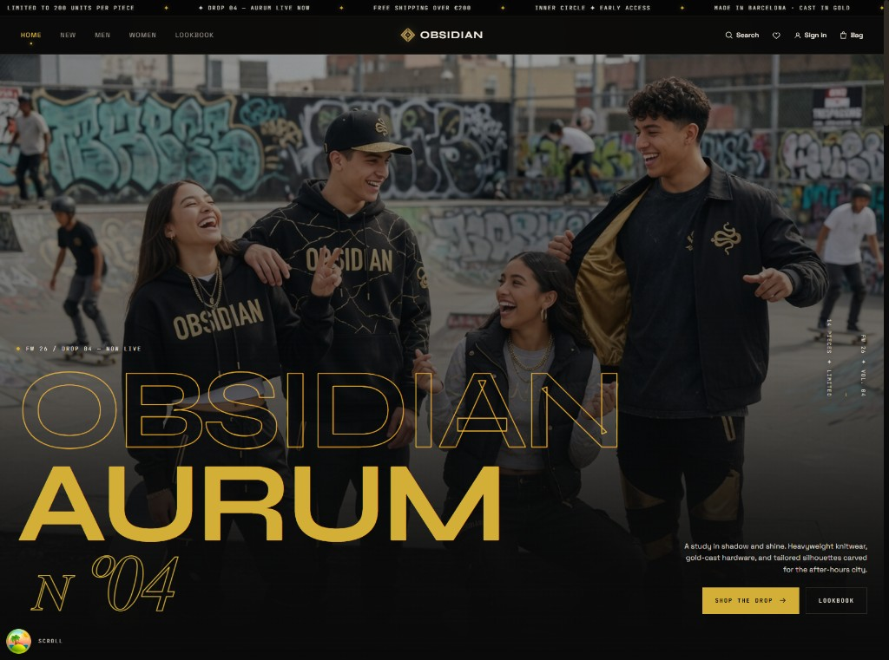
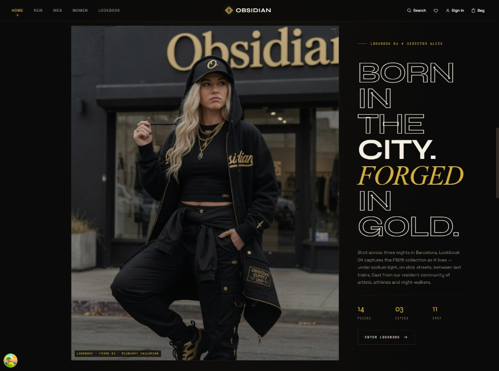
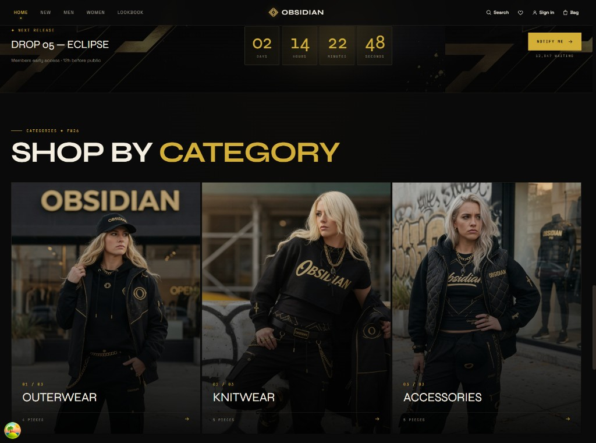
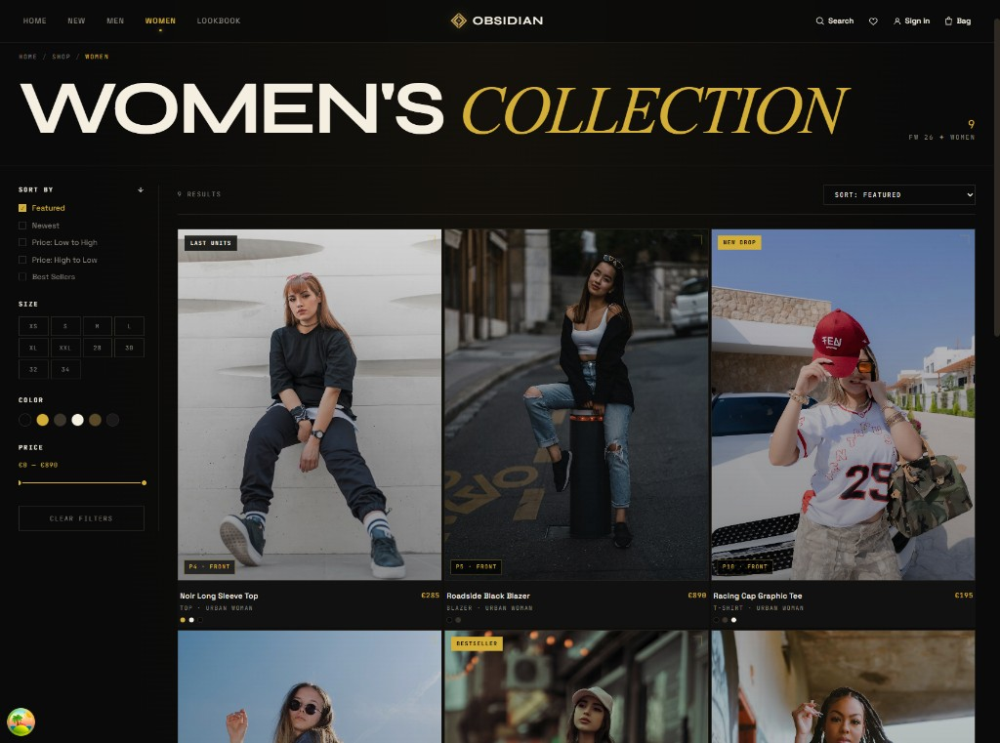
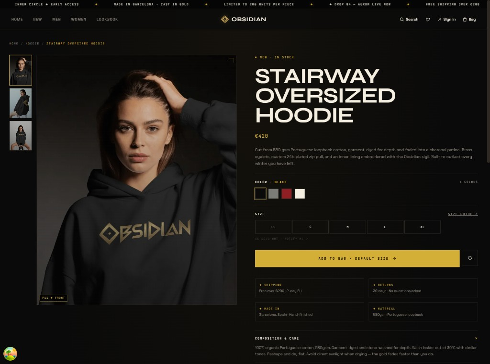

# OBSIDIAN - FW26 Aurum


E-commerce full-stack de streetwear urbano creado como proyecto de portfolio: una tienda React con estética oscura y acentos dorados, conectada a una API Laravel 11, desplegada con base de datos de producción y flujos reales de usuario autenticado.

El objetivo es demostrar cómo se planifica, implementa y despliega una app de comercio con enfoque real: catálogo servido por API, área de cuenta autenticada, carrito y wishlist sincronizados, creación de pedidos, despliegue en producción y decisiones técnicas documentadas.

> Estado: Etapa 8 completada. Disponible en
> [`obsidian.aleixaj.com`](https://obsidian.aleixaj.com), con API Laravel en
> Railway, base de datos MySQL gestionada y usuario demo seed.

## Capturas











## Alcance del Proyecto

Este repositorio contiene el frontend. El backend vive en
[`AleixAj/obsidian-api`](https://github.com/AleixAj/obsidian-api).

Funcionalidades implementadas:

- Despliegue de producción: [`obsidian.aleixaj.com`](https://obsidian.aleixaj.com).
- Catálogo servido por endpoints Laravel (`/api/products`, `/api/categories`).
- Páginas de listado con filtros por categoría, talla, color, precio y ordenación.
- Página de producto con galería, selector de talla/color y sección "complete the look".
- Drawer de carrito con cantidades, totales, progreso de envío gratis, sincronización backend y checkout básico.
- Wishlist persistente para invitados y sincronizada con backend para usuarios autenticados.
- Dashboard de cuenta con resumen, pedidos, CRUD de direcciones y ajustes de perfil.
- Registro/login con email y contraseña usando sesiones cookie de Laravel Sanctum.
- Merge de carrito/wishlist invitado después de login o registro.
- Checkout básico que convierte el carrito autenticado en un pedido real.
- Layout responsive hasta móvil.
- Skeletons de carga y estados de error reintentables.
- React Query Devtools en desarrollo.

## Stack Técnico

| Capa | Elección | Motivo |
|---|---|---|
| Build | Vite 8 | Desarrollo SPA rápido y despliegue estático sencillo. |
| UI | React 19 | Modelo de componentes, hooks y buena relevancia profesional. |
| Lenguaje | TypeScript 6 | Refactors más seguros y modelos de dominio compartidos. |
| Routing | React Router 7 | Páginas y secciones de cuenta guiadas por URL. |
| Server state | TanStack React Query 5 | Caché, estados de carga/error, retries y deduplicación de peticiones. |
| Client state | React Context | Carrito, wishlist y toasts sin añadir Redux. |
| Persistencia | `localStorage` + backend cart/wishlist | Invitados conservan datos; usuarios sincronizan con Laravel al autenticarse. |
| Estilos | CSS plano + tokens | Demuestra fundamentos de CSS sin depender de un framework. |
| Backend | Laravel 11 API | Repositorio separado, endpoints REST, Sanctum auth y MySQL en producción. |
| Deploy | Cloudflare Workers + Assets + Railway | SPA en Cloudflare edge, API Laravel con MySQL gestionado. |

## Arquitectura

El frontend mantiene clara la frontera con la API:

```txt
DTOs de Laravel API
      |
      v
src/lib/api.ts
  - fetchProducts()
  - fetchProduct()
  - fetchCategories()
  - toProduct()
  - toCategoryMap()
      |
      v
src/hooks/queries/
  - useProducts()
  - useProduct()
  - useCategories()
  - useAuth()
  - useAccount()
  - useCartSync()
  - useWishlistSync()
      |
      v
Pages y componentes reciben objetos Product listos para UI
```

Esto evita que la UI renderice directamente campos de backend como `price_cents` o `img_alt`. Si cambia la forma de la API, el adapter se actualiza en un único punto.

### Configuración de QueryClient

`src/lib/queryClient.ts` define un cliente compartido:

- `staleTime: 60_000`, porque el catálogo cambia poco durante una sesión.
- `retry: 1`, para recuperarse de fallos transitorios sin retrasar demasiado al usuario.
- `refetchOnWindowFocus: false`, para evitar refetches ruidosos al cambiar de pestaña.

### Estado local vs estado servidor

React Query gestiona datos de servidor (`products`, `categories`, `user`, `account`, `cart` autenticado, `wishlist` autenticada). React Context gestiona estado local de UI (`toasts`) y expone las APIs de carrito/wishlist a los componentes.

Los invitados usan `localStorage`, los usuarios autenticados usan la API Laravel, y ambos estados se fusionan después de login/registro. Así la navegación como invitado es rápida sin perder portabilidad entre dispositivos.

## Estructura del Proyecto

```txt
src/
├── components/
│   ├── cart/          # CartDrawer
│   ├── layout/        # Header, Footer, AnnounceBar, Layout
│   ├── product/       # ProductCard, ProductCardSkeleton
│   └── ui/            # Logo, Icon, Marquee, Placeholder, Reveal
├── context/           # CartContext, WishlistContext, ToastContext
├── data/              # Assets visuales/editoriales de marca
├── hooks/
│   ├── queries/       # Hooks React Query
│   ├── useLocalStorage.ts
│   └── useReveal.ts
├── lib/               # Cliente API + QueryClient
├── pages/             # Home, Shop, Product, Lookbook, Auth, Account
├── styles/            # Tokens CSS, globales y estilos por página
├── types/             # Product, CartItem, Category
└── utils/             # formatPrice, pad
```

Documentación útil:

- [`PROCESS.md`](./PROCESS.md) - notas paso a paso sobre decisiones técnicas.
- [`.notes/etapa-8-checkpoint.md`](./.notes/etapa-8-checkpoint.md) - checkpoint del despliegue.

## Setup Local Full-Stack

### 1. Arrancar el backend

```powershell
cd C:\Users\Kylen\Desktop\Projects\obsidian-api
php artisan serve
```

Laravel debería estar disponible en `http://localhost:8000`.

Comprobaciones útiles:

```powershell
Invoke-RestMethod http://localhost:8000/api/health
Invoke-RestMethod http://localhost:8000/api/products
Invoke-RestMethod http://localhost:8000/api/categories
```

### 2. Arrancar el frontend

```powershell
cd C:\Users\Kylen\Desktop\Projects\obsidian
npm install
npm run dev
```

Vite debería estar disponible en `http://localhost:5173`.

El frontend lee la URL base de la API desde:

```env
VITE_API_URL=http://localhost:8000
```

En producción usa:

```env
VITE_API_URL=https://obsidian-api-production-8b5e.up.railway.app
```

## Scripts

```bash
npm run dev        # arranca Vite en desarrollo
npm run typecheck  # comprueba TypeScript sin emitir archivos
npm run build      # build de producción
npm run preview    # previsualiza dist localmente
npm run lint       # ESLint
```

Verificado tras Etapa 8:

- `npm run typecheck` pasa.
- `npm run build` pasa.
- Smoke checks de producción contra Railway/Cloudflare.
- Auth Sanctum funciona desde `obsidian.aleixaj.com`.
- Las imágenes y datos de catálogo cargan desde la API de Railway.

## Producción

- Frontend: [`https://obsidian.aleixaj.com`](https://obsidian.aleixaj.com)
- Backend API: [`https://obsidian-api-production-8b5e.up.railway.app`](https://obsidian-api-production-8b5e.up.railway.app)
- Health check: [`/api/health`](https://obsidian-api-production-8b5e.up.railway.app/api/health)
- Usuario demo: `demo@obsidian.test`

Notas de despliegue:

- El frontend se despliega con Cloudflare Workers + Assets usando `wrangler.jsonc`.
- Comando de build en Cloudflare: `npm run build`.
- Comando de deploy: `npx wrangler deploy`.
- El fallback SPA se gestiona con `not_found_handling="single-page-application"`.
- Se eliminó el antiguo `_redirects` porque provocaba un bucle de redirecciones en Workers + Assets.
- `src/lib/api.ts` evita que builds de producción usen `localhost:8000` por error.

## Contrato con el Backend

El frontend consume actualmente:

| Método | Endpoint | Uso |
|---|---|---|
| `GET` | `/api/products` | Home, recomendaciones, Account |
| `GET` | `/api/products?category={slug}` | Páginas Shop por categoría |
| `GET` | `/api/products/{slug}` | Detalle de producto |
| `GET` | `/api/categories` | Metadata del header de Shop |
| `GET` | `/api/health` | Smoke checks/manual monitoring |
| `GET` | `/api/user` | Usuario autenticado actual |
| `PATCH` | `/api/user` | Actualizar nombre/email |
| `POST` | `/api/auth/register` | Crear cuenta e iniciar sesión |
| `POST` | `/api/auth/login` | Login email/password |
| `POST` | `/api/auth/logout` | Logout servidor |
| `GET` | `/api/account` | Resumen dashboard cuenta |
| `GET` | `/api/orders` | Pedidos del usuario |
| `GET` | `/api/addresses` | Direcciones del usuario |
| `POST` | `/api/addresses` | Crear dirección |
| `PATCH` | `/api/addresses/{id}` | Editar dirección / marcar default |
| `DELETE` | `/api/addresses/{id}` | Borrar dirección |
| `GET` | `/api/cart` | Carrito autenticado |
| `POST` | `/api/cart/items` | Añadir producto al carrito |
| `PATCH` | `/api/cart/items/{id}` | Cambiar cantidad |
| `DELETE` | `/api/cart/items/{id}` | Eliminar línea |
| `DELETE` | `/api/cart/items` | Vaciar carrito |
| `POST` | `/api/cart/merge` | Fusionar carrito guest tras login/register |
| `POST` | `/api/checkout` | Convertir carrito en pedido |
| `GET` | `/api/wishlist` | Slugs de wishlist autenticada |
| `POST` | `/api/wishlist/items` | Añadir producto a wishlist |
| `DELETE` | `/api/wishlist/items/{slug}` | Quitar producto de wishlist |
| `DELETE` | `/api/wishlist/items` | Vaciar wishlist |
| `POST` | `/api/wishlist/merge` | Fusionar wishlist guest tras login/register |

El dinero se almacena en la API como céntimos enteros (`price_cents`). El adapter lo transforma al `Product.price` que renderizan los componentes.

## OAuth Setup (Pendiente)

Las rutas de OAuth con Google/GitHub están preparadas en Laravel, pero las credenciales no se han configurado todavía. Para activarlo, crear apps OAuth y añadir en Railway:

```env
GOOGLE_CLIENT_ID=
GOOGLE_CLIENT_SECRET=
GOOGLE_REDIRECT_URI=https://obsidian-api-production-8b5e.up.railway.app/auth/google/callback

GITHUB_CLIENT_ID=
GITHUB_CLIENT_SECRET=
GITHUB_REDIRECT_URI=https://obsidian-api-production-8b5e.up.railway.app/auth/github/callback
```

Mientras no existan esos valores, los botones sociales redirigen de vuelta a `/auth` con un error claro de "not configured".

## Stripe Setup (Pendiente)

Las dependencias/env placeholders de Stripe/Cashier existen en el backend, pero el cobro real queda aplazado hasta configurar claves y webhook. El checkout actual ya crea pedidos reales sin cobrar tarjeta.

## Roadmap

- [x] Etapa 0 - Decisiones de arquitectura.
- [x] Etapa 1 - Backend Laravel 11, esquema, seeders y API pública.
- [x] Etapa 2 - SPA React consumiendo backend con React Query.
- [x] Etapa 3 - Auth real: email/password + rutas OAuth preparadas.
- [x] Etapa 4 - Dashboard de cuenta conectado a datos reales.
- [x] Etapa 5 - Carrito guest sincronizado con usuario al hacer login.
- [x] Etapa 6 - Checkout básico: carrito autenticado -> pedido.
- [x] Etapa 7 - Wishlist sincronizada entre dispositivos.
- [x] Etapa 8 - Deploy: Cloudflare Workers + Assets, Railway y usuario demo.
- [ ] Pulido final - Activar pagos Stripe y credenciales OAuth.

## Por Qué Importa Este Proyecto

Obsidian no es solo un mockup estático. Está estructurado como un proyecto pequeño de producción:

- La UI tiene suficiente acabado para evaluar criterio visual.
- La frontera con backend es real, tipada y aislada.
- Auth, carrito, wishlist, cuenta y checkout cruzan frontend/backend.
- El fetching contempla caché, retries, loading states y errores.
- La app está desplegada con configuración real, base de datos gestionada y smoke checks.
- Las decisiones están documentadas en `PROCESS.md`, incluyendo trade-offs.
- El roadmap es incremental para poder revisar y desplegar por etapas.

## Créditos

- Imágenes: Unsplash y assets locales/editoriales de marca.
- Tipografía: Syne, Space Grotesk y JetBrains Mono vía Google Fonts.
- Logo y dirección visual: concepto Obsidian Studio.

---

Proyecto de portfolio. No es una tienda real.
